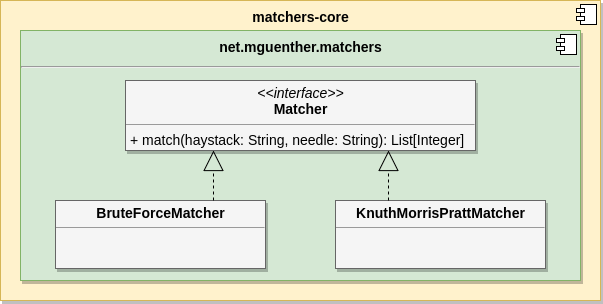
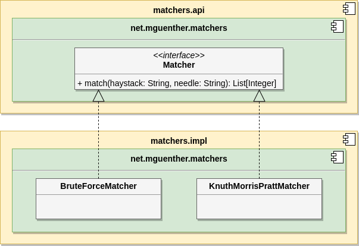
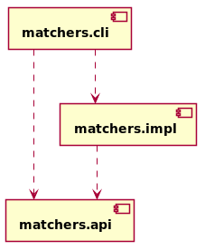

[[section:migration-matchers-core]]

## Modularizing an existing codebase

Before we dive into the modularization of our existing codebase, we have to talk a bit about the implications on the JPMS when using it together with a build tool like Maven. It is perfectly viable to have multiple modules inside a single `src` folder, as long as module boundaries are properly set by providing the necessary module descriptors for your modules. Maven implies a restriction that enforces a 1:1-relationship between a Maven module and the Java module it contains. So for instance, if our `matchers-core` module comprises two Java modules within source folder `src`, call them `matchers.api` and `matchers.impl`, the IDE will present the following error condition:

`_module-info.java` already exists within module_

In this case, our solution will not compile. This is pretty self-explanatory actually: The target artifact of a Maven module is a single JAR (or POM, or WAR, ...) which is addressable by its Maven coordinates. Allowing multiple Java modules (which are packaged as JARs themselves) within a Maven module would break the semantics of the Maven coordinates.

Through the course of this migration guide, we will denote Maven modules using hyphens, like `matchers-core`, and Java modules using decimal points, like `matchers.impl` to distinguish them in the text. It is perfectly fine though if you keep both the Maven and Java module synchronized.

### Separating API from implementation

Recall the layout of Maven module `matchers-core`.

[.small]_Figure 3: Both API and implementation are sharing the same package space._

All interfaces and classes reside in the same package. First of all, First, we will create a new Maven module, call it `matchers-api` that will host a Java module, call it `matchers.api`, comprising the API for our string matching algorithms footnote:[We will not show the Maven modules in the diagrams, but only focus on the Java modules.]. The interface `Matcher` is copied over to this module and we will expose it to other modules by exporting the whole package footnote:[This is okay, since this module comprises only classes and interfaces that contribute to the public API of our application.]. We will keep the interface `Matchers` in its original module as well, so the build does not break just yet.

[source,java]
----
module matchers.api {
  exports net.mguenther.matchers;
}
----

After applying our changes, the source tree of the module looks like this:

[source,bash]
----
matchers-api
├── pom.xml
└── src
    └── main
        └── java
            ├── module-info.java
            └── net
                └── mguenther
                    └── matchers
                        └── Matcher.java
----

As for the actual implementations of interface `Matchers`, we will re-use Maven module `matchers-core` and introduce the Java module `matchers.impl` to it. This is done by adding a `module-info.java` to the folder `src/main/java` of the Maven module that declares a _requires_-relationship with `matchers.api` (note that we explicitly address the Java module, not a package) and that also declares the things that it exports.

[source,java]
----
  requires matchers.api;
  exports net.mguenther.matchers;
----

Introducing this `module-info.java` will yield a couple of errors. First, the Maven module `matchers-api` - which contains the required dependency `matchers.api` - is not in the set of Maven dependencies for Maven module `matchers-core`. Using the JPMS does not relieve us from dealing with dependencies on the level of Maven. However, we can fix this quite easily by adding the following code to the `pom.xml` of the respective Maven module.

[source,xml]
----
<dependency>
  <groupId>net.mguenther.matchers</groupId>
  <artifactId>matchers-api</artifactId>
  <version>0.1.0-SNAPSHOT</version>
</dependency>
----

After introducing this dependency, we can finally delete the interface `Matcher` from module `matchers.impl` and use the one from module `matchers.api` instead.

But we still have an error, though, and that error is currently breaking our build. The IDE already points it out:

_Package 'net.mguenther.matchers' exists in another module: 'matchers.api'_

Let us take a step back and look at what we achieved so far.

[.small]_Figure 4: The JPMS prohibits packages that are shared across multiple modules._

Although the separation into two distinct modules fits quite nicely, the package boundaries do not: We introduced a so called _split package_. A split package is a package that spans multiple modules. The JPMS enforces that a single package has its dedicated Java module and thus prohibits the use of split packages. From a package design perspective, this seems a bit unnatural as both modules contribute to the same component and, at least from my understanding, a component can surely span multiple modules footnote:[The closure of a component must not even be known at compile time. Think of pluggable application architectures, in which you simply add modules (JARs) to the module path to extend the functionality of a component.].

Anyhow, to fix the issue, we have to abide by the rule that a Java module cannot share packages it contains, so we rename `net.mguenther.matchers` of module `matchers.impl` into `net.mguenther.matchers.impl` for the time being. We end up with a working solution that looks like this.

[.small]_Figure 5: Each Java module has to use its own package._

The standard Maven directory layout still applies, even if we take the JUnit tests into account that exist for the matcher implementations. After applying all changes, it should look like this.

[source,bash]
----
matchers-kmp
├── pom.xml
└── src
    ├── main
    │   └── java
    │       ├── module-info.java
    │       └── net
    │           └── mguenther
    │               └── matchers
    │                   └── impl
    │                       └── BruteForceMatcher.java
    │                       └── KnuthMorrisPrattMatcher.java
    └── test
        └── java
            └── net
                └── mguenther
                    └── matchers
                        └── impl
                            ├── BruteForceMatcherTest.java
                            └── KnuthMorrisPrattMatcherTest.java

----

### Refactoring the CLI to a top-level application module

Although we provided a clean and working separation for the API and its implementation, our current application will not compile. This is due to the fact that Maven module `matchers-cli` does not implement a Java module. Hence, it is moved to the unnamed module and from there it has no access to the classes and interfaces that are exported from Java modules `matchers.api` and `matchers.impl`. So, if we try to compile the solution anyway, Maven will fail with a compilation error as it cannot resolve the symbols for classes that the CLI imports.

We simply execute the same procedure again as we did already when we separated the API from the implementation and introduce a new Java module as part of `matchers-cli` which we aptly name `matchers.cli`. Its module descriptor needs to declare a _requires_-relationship to both modules:

[source,java]
----
module matchers.cli {
  requires matchers.api;
  requires matchers.impl;
}
----

With this module descriptor in place, the solution comprising all three modules should build and run perfectly fine. Have a look at what we achieved so far in terms of (enclosing) Maven modules. Note that there is a 1:1-correlation between the dependency graph of the Maven modules and the dependency graph of the resp. Java modules.

[.small]_Figure 6: The CLI still has an unwanted dependency on `matchers.impl`._

But contrary to our initial mission statement, this makes one thing quite obvious: We are still not getting rid of the unwanted dependency from CLI to the implementation. We will address this issue in the following chapter.