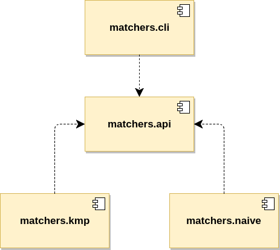

[[section:migration-service-loaders]]

## Using service loaders

Although we progressed through to a working, modularized solution for our string matchers during the last chapter, we still have an unwanted dependency that goes directly from module `matchers.cli` to `matchers.impl`. This prohibits us from using a clean and extensible way of injecting implementations of the `Matcher` interface. Working through this chapter, our goal is to end up with a very loose coupling between our Java modules by implementing a mechanism for that kind of dependency injection. One way to do this is by using the Service Loader API footnote:[The Service Loader API is not new to Java 9, but has been around since Java 6.].

We will not go into detail on the actual Service Loader API, its specification and other technicalities, but rather focus on its integration with the JPMS for providing and consuming services. All we need to know to this point is that our consuming module `matchers.cli` will simply declare that it requires an implementation of the `Matcher` interface and the Service Loader API will provide it with such an implementation footnote:[Unless there is no such implementation on the module path.].

Before we do so, we extend the `Matcher` interface to also provide a name or (technical) identifier for the implemented algorithm.

[source,java]
----
public interface Matcher {

  List<Integer> match(String haystack, String needle);

  String getName();
}
----

This will make it easy to identify a given implementation from within the CLI. The required adaptations in `matchers.impl` are not covered here.

### Providing services

After the adaption, we need to change the module descriptor of `matchers.impl` and use `provides` to declare our services. This is where we hit the first caveat.

[source,java]
----
module matchers.impl {

  requires matchers.api;

  provides net.mguenther.matchers.Matcher
      with net.mguenther.matchers.impl.BruteForceMatcher;
  provides net.mguenther.matchers.Matcher
      with net.mguenther.matchers.impl.KnuthMorrisPrattMatcher;
}
----

It is not possible to provide more than a single implementation for a given interface. The compiler will fail with: _Duplicate 'provides': net.mguenther.matchers.Matcher_. This is actually due to the design of the Service Loader API. Prior to Java 9 you would have to place a file named `net.mguenther.matchers.Matcher` into directory `META-INF/services` that must consist of only a single line of text, for example `net.mguenther.matchers.impl.BruteForceMatcher`. Back then the Service Loader API was unable to deal with multiple implementations in a JAR as well and thus had the same restriction.

Due to the limited capabilities of the Service Loader API we have to split up our modules even further. Here is what our final solution will look like.

[.small]_Figure 7: Each string matching algorithm to its own Java module, thus enabling an even better form of loose coupling via service providers._

This will provide a very clean separation between the CLI and our algorithms, since both only have to depend on module `matchers.api`. We will not go into much detail on splitting up those modules again, since we have done this exhaustively during the course of the last chapter. So, to sum up: We will move `BruteForceMatcher` into a Java module called `matchers.naive` (with its enclosing Maven module `matchers-naive`) and the `KnuthMorrisPrattMatcher` into module `matchers.kmp` (with its enclosing Maven module `matchers-kmp`). After introducing these two new modules, we can get rid of `matchers.impl` altogether.

The module descriptors for both `matchers.naive` and `matchers.kmp` satisfy the constraint of the Service Loader API. The listing underneath shows the module descriptor for `matchers.naive` to give you an example.

[source,java]
----
module matchers.naive {

  requires matchers.api;

  provides net.mguenther.matchers.Matcher
      with net.mguenther.matchers.naive.BruteForceMatcher;
}
----

### Consuming services

As long as modules `matchers.naive` and `matchers.kmp` are on the module path, the implementations provided for interface `Matcher` will get picked up by the service loader mechanism. The changes on the consuming side are simple. As part of the module descriptor for `matchers.cli`, we have to declare that we want to use all available services for interface `Matcher`.

[source,java]
----
module matchers.cli {

  requires matchers.api;

  uses net.mguenther.matchers.Matcher;
}
----

Note that we got rid of the dependency from `matchers.cli` to the implementing modules `matchers.naive` and `matchers.kmp` altogether! But to complete our mission, we will have to adapt the code in class `MatchersCli`. The following listing shows how to get all available services for the requested interface.

[source,java]
----
Iterable<Matcher> availableMatchers =
  ServiceLoader.load(Matcher.class);
for (Matcher matcher : availableMatchers) {
  System.out.println(
    "Found matcher '" + matcher.getName() + "' " +
    "provided by '" + matcher.getClass().getName() + "'.");
}
----

The tight coupling to the individual implementations is gone, instead, we use the abstractions provided by class `java.util.ServiceLoader`. For the sake of the example, we keep things simple and store a (name, matcher)-relation using a `Map<String, Matcher>` while doing doing a reverse-lookup based on the name to select the algorithm for the search.

We still have to put the modules that contain the implementations on the module path. On your local machine, this can be done using your IDE for testing purposes. For IntelliJ IDEA, this is easy: Open up the module settings, go to module `matchers.cli` and add runtime module dependencies for those modules that you want to put on the module path. If you start the CLI via console, you can add the resp. modules to the module path providing a `--add-modules <modules>` via command-line arguments.

### Providing a new algorithm

Using the Service Loader API, we can finally add additional implementations quite easily, without the need to modify any of our existing code. Let's say that we also want to provide a Boyer-Moore matcher. The steps involved are:

1. Create a new Maven module, call it `matchers-boyer-moore`, that closes over a Java module, call it `matchers.bm`.
2. Implement the algorithm in a class called `BoyerMooreMatcher`. `BoyerMooreMatcher` must implement the `Matcher` interface for obvious reasons.
3. Provide a module descriptor that exposes the `BoyerMooreMatcher` as a provided service of module `matchers.bm`

[source,java]
----
module matchers.bm {

  requires matchers.api;

  provides net.mguenther.matchers.Matcher
      with net.mguenther.matchers.bm.BoyerMooreMatcher;
}
----

4. Put the module on the module path.

This approach is compliant with the Open-Closed-Principle, as none of the existing had to be modified to introduce a new strategy for matching strings.

### Shortcomings

We have achieved quite a lot so far! Uncle Bob would surely approve that we are compliant with the Open-Closed-Principle, but still, we haven't talked about shortcomings and possible error scenarios yet. What if there is no module on the module path that contributes an implementation of the `Matcher` interface? How can we implement more elaborate selection schemes which are able to choose an implementation based on quality of service aspects rather than a simple name matching? We will address these questions in the upcoming chapters.