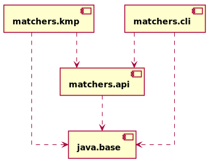

[[section:use-default-implementations]]

## Using a default service provider

What if there is no module on the module path that provides a suitable implementation of `Matcher`? What if there is no implementation of that interface at all? In this case, it is possible to provide a default implementation alongside the public API. The benefit is, that once the API module is distributed, it can definitely be put to use, even if the default implementation does not exhibit the quality aspects that we aimed for. Providing a default implementation is quite simple. Let us have a look again at the module graph of our application.

image::images/service-provider-java-modules.png[]
[.small]_Figure 8: The current state of affairs for our little string matching application._

We currently have two distinct implementations of the public API as exposed via module `matchers.api`. One of these implementations features an elaborate and fast algorithm designed by Knuth, Morris and Pratt. The other one is a rather naive implementation that follows a brute-force technique. Deliberately selecting the brute-force algorithm over the more sophisticated Knuth-Morris-Pratt matcher is probably not going to happen considering its performance characteristics. However, it is a stable solution and solves the given problem. We could use it as a fallback mechanism in case there is no implementation that satisfies the quality constraints or in case there is no additional module at all which could provide an implementation.

Co-locating the `BruteForceMatcher` along with the public API will give us a self-contained solution that will work out of the box.

To achieve this, we will move class `BruteForceMatcher` as well as its JUnit tests to module `matchers.api` while retaining the original package layout. Thus, the source tree for module will look similar to this.

[source,bash]
----
matchers-api
├── pom.xml
└── src
    ├── main
    │   └── java
    │       ├── module-info.java
    │       └── net
    │           └── mguenther
    │               └── matchers
    │                   ├── naive
    │                   │   └── BruteForceMatcher.java
    │                   ├── Experimental.java
    │                   ├── Fast.java
    │                   ├── MatcherCharacteristics.java
    │                   ├── Matcher.java
    │                   └── Stable.java
    └── test
        └── java
            └── net
                └── mguenther
                    └── matchers
                        └── naive
                           └── BruteForceMatcherTest.java
----

Module `matchers.naive` is no longer required and can be safely removed from the project altogether with its corresponding Maven module `matchers-naive`. We end up with a module graph like the following.

[.small]_Figure 9: The final module graph after removing the obsolete module `matchers.naive`._

The API module does not have to export the default implementation - it will remain an implementation detail of the module. But it has to provide the same service that the original module `matchers.naive` provided as well. This is easily done by a small adjustment to the module descriptor of module `matchers.api` footnote:[`import` statements are omitted.].

[source,java]
----
module matchers.api {

  exports net.mguenther.matchers;

  provides net.mguenther.matchers.Matcher
      with net.mguenther.matchers.naive.BruteForceMatcher;
}
----

How does a service consumer switch to a default implementation? Recall that we used the Service Loader API to retrieve all implementations of interface `Matcher` and filtered it using the Streams API to select the one which best suited our needs.

[source,java]
----
Optional<Matcher> optionalMatcher = ServiceLoader
  .load(Matcher.class)
  .stream()
  .filter(provider -> MatcherCharacteristics.isStable().test(provider.type()))
  .findFirst()
  .map(ServiceLoader.Provider::get);
----

The final `map` will result in `Optional.empty()` if a suitable implementation was not found. Let's say that `MatcherCharacteristics` provides not only predicates for different quality aspects, but also a method `useDefault()` that is a factory method for creating instances of the default `BruteForceMatcher`. We can easily fallback to the default using `Optional.orElseGet` like the underneath listing demonstrates.

[source,java]
----
Matcher matcher = ServiceLoader
  .load(Matcher.class)
  .stream()
  .filter(provider -> isStable().and(isFast()).test(provider.type()))
  .findFirst()
  .map(ServiceLoader.Provider::get)
  .orElseGet(MatcherCharacteristics::useDefault);
----

